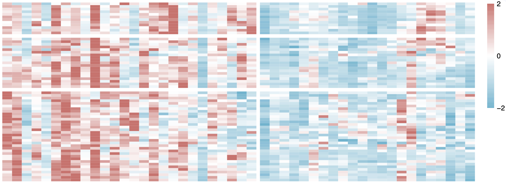
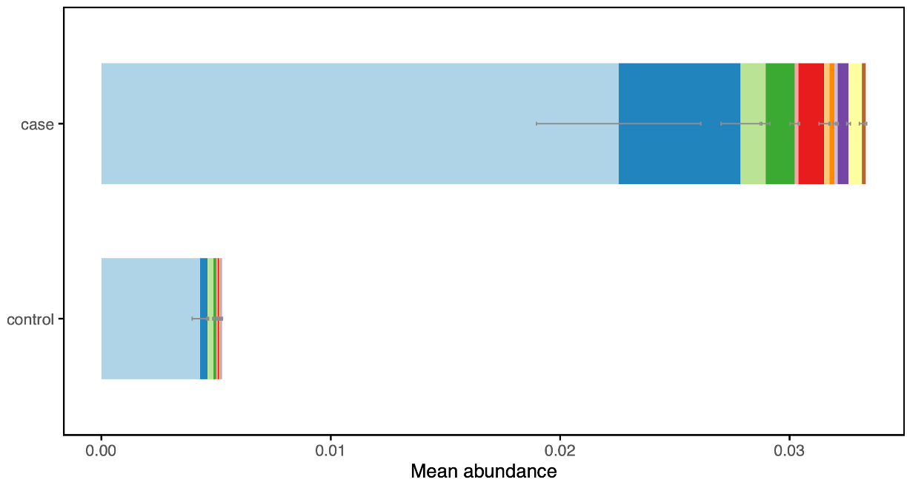
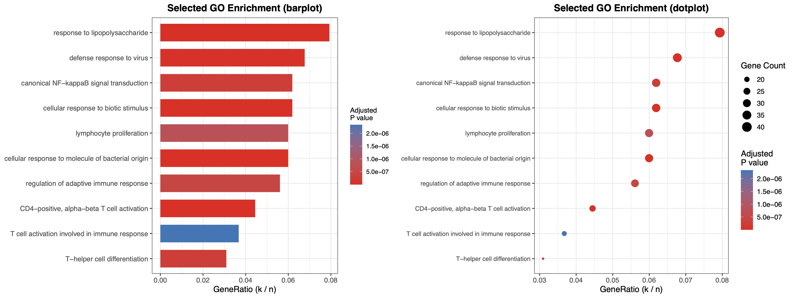
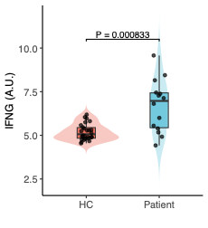
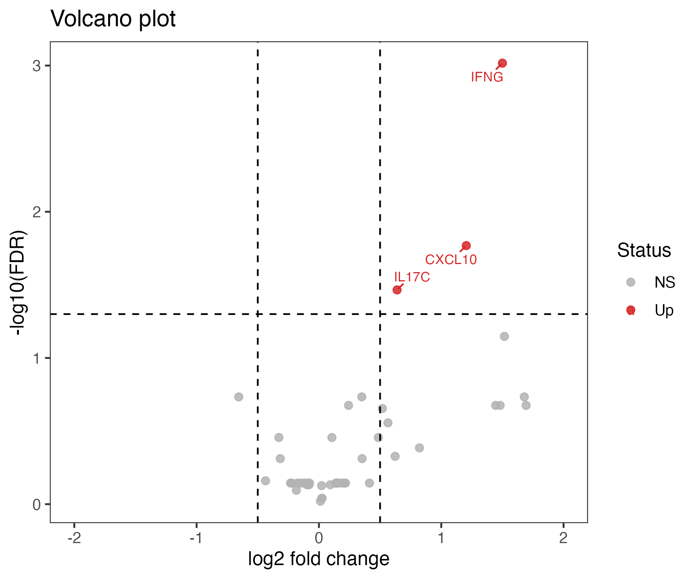

# Heatmap.gap.cluster.R 



# Barplot.SE.R



# plot_GO_selected.R

## Usage
```bash
Rscript plot_GO_selected.R GO_BP_up_from_list_all.tsv GO_terms_to_show.txt file_GO_up
```


# run.DESeq2.R

## Usage
```bash
Rscript run.DESeq2.R file.RNA-seq.count.matrix.tsv sample.info.clean.tsv output_prefix
```

# violin.R




# volcano.R


